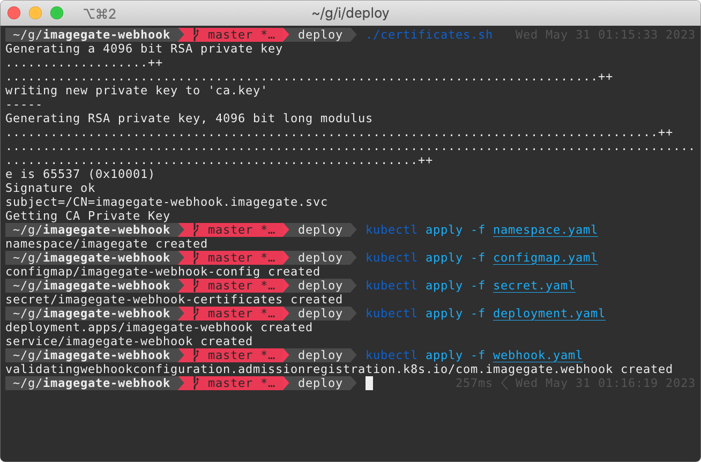
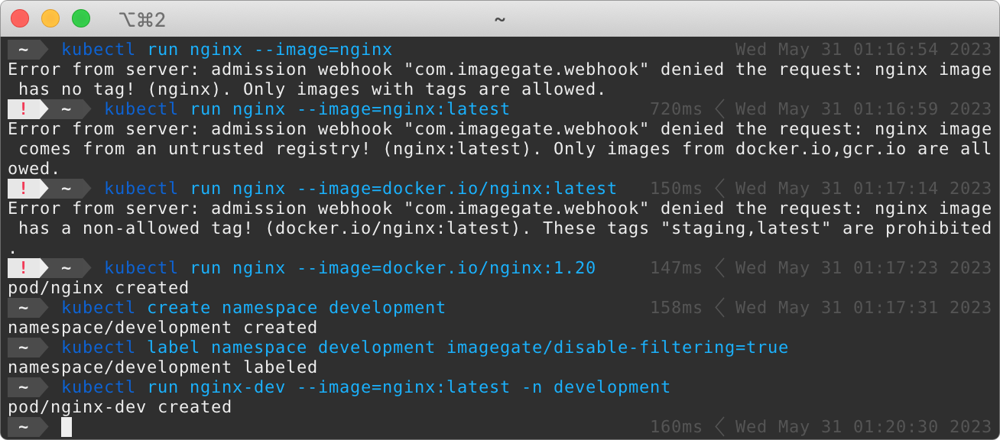

# ImageGate

**Problem:** "I want to make my cluster more secure and add restrictions on the images used in production."

**Solution:** Install [Open Policy Agent](https://www.openpolicyagent.org/docs/latest/kubernetes-primer/#writing-policies) and add the custom rule to restrict docker images.

**Can I do it easier?** Sure, you can, just install ImageGate and configure allowed registries, prohibited image tags and enable/disable non-tagged images.

### Overview

ImageGate is a tool to prevent running Pod from untrusted registries and using non-allowed image tags.

It's composed of two parts:

- ImageGate Deployment (with ConfigMap-stored parameters) and ClusterIP Service
- [ValidatingWebhookConfiguration](https://kubernetes.io/docs/reference/access-authn-authz/extensible-admission-controllers/) to validate new Pods configuration
 
### Configuration

These are the environment variables understood by the container image.
| **Variable**           | **Description**                                                                                       |
| :----------------- | :------------------------------------------------------------------------------------------------ |
| ALLOWED_REGISTRIES | List of allowed Docker registries, can be `, ; \|` separated. Default value is `docker.io,gcr.io` |
| BLOCKED_TAGS       | List of prohibited image tags, can be `, ; \|` separated. Default value is `staging,latest`       |
| DISABLE_EMPTY_TAG  | Block images with an empty tag. Default value is `true`                                           |

These parameters are stored in the [configmap.yaml](deploy/configmap.yaml) file.

Also you can prevent some of the namespaces from filtering by adding the `imagegate/disable-filtering=true` label to them.

### Installation

Clone this repository and go to the `deploy` folder:

```bash
git clone https://github.com/ganochenkodg/imagegate-webhook.git
cd imagegate-webhook/deploy
```

Generate new self-signed certificates by running the next command:

```console
$ ./certificates.sh
Generating a 4096 bit RSA private key
........................................................................................................................................++
..++
writing new private key to 'ca.key'
-----
Generating RSA private key, 4096 bit long modulus
.......................................++
..........................++
e is 65537 (0x10001)
Signature ok
subject=/CN=imagegate-webhook.imagegate.svc
Getting CA Private Key
```

Create the `imagegate` namespace:

```console
$ kubectl apply -f namespace.yaml
namespace/imagegate created
```

Deploy ImageGate with certificates and required configuration by running these commands:

```console
$ kubectl apply -f secret.yaml
secret/imagegate-webhook-certificates created
$ kubectl apply -f configmap.yaml
configmap/imagegate-webhook-config created
$ kubectl apply -f deployment.yaml
deployment.apps/imagegate-webhook created
service/imagegate-webhook created
```

Check if ImageGate works:

```console
$ kubectl get pod -n imagegate
NAME                                 READY   STATUS    RESTARTS   AGE
imagegate-webhook-67f797d445-7k889   1/1     Running   0          66s
$ kubectl logs imagegate-webhook-67f797d445-7k889 -n imagegate
5/30/2023, 10:01:21 PM: ImageGate is ready!
```



### Usage

Since we're using the default configuration, let's try to create a Pod with an inappropriate image. 
Current we allow to use image from `docker.io` and `gcr.io` registries, require to set any tag, but disallow to use latest and staging tags.

```console
$ kubectl run nginx --image=nginx
Error from server: admission webhook "com.imagegate.webhook" denied the request: nginx image has no tag! (nginx). Only images with tags are allowed.
add label
$ kubectl run nginx --image=nginx:latest
Error from server: admission webhook "com.imagegate.webhook" denied the request: nginx image comes from an untrusted registry! (nginx:latest). Only images from docker.io,gcr.io are allowed.
$ kubectl run nginx --image=docker.io/nginx:latest 
Error from server: admission webhook "com.imagegate.webhook" denied the request: nginx image has a non-allowed tag! (docker.io/nginx:latest). These tags "staging,latest" are prohibited.
$ kubectl run nginx --image=docker.io/nginx:1.20
pod/nginx created
```

Let's create new `development` namespace without any restrictions:

```console
$ kubectl create namespace development
namespace/development created
$ kubectl label namespace development imagegate/disable-filtering=true 
namespace/development labeled
$ kubectl run nginx-dev --image=nginx:latest -n development 
pod/nginx-dev created
```



## Cleanup

To remove ImageGate please run next commands:

```console
$ kubectl delete validatingwebhookconfiguration com.imagegate.webhook
validatingwebhookconfiguration.admissionregistration.k8s.io "com.imagegate.webhook" deleted
$ kubectl delete ns imagegate
namespace "imagegate" deleted
```


